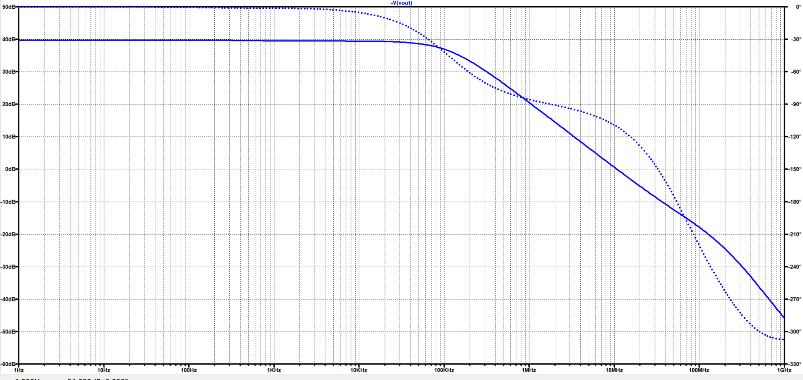
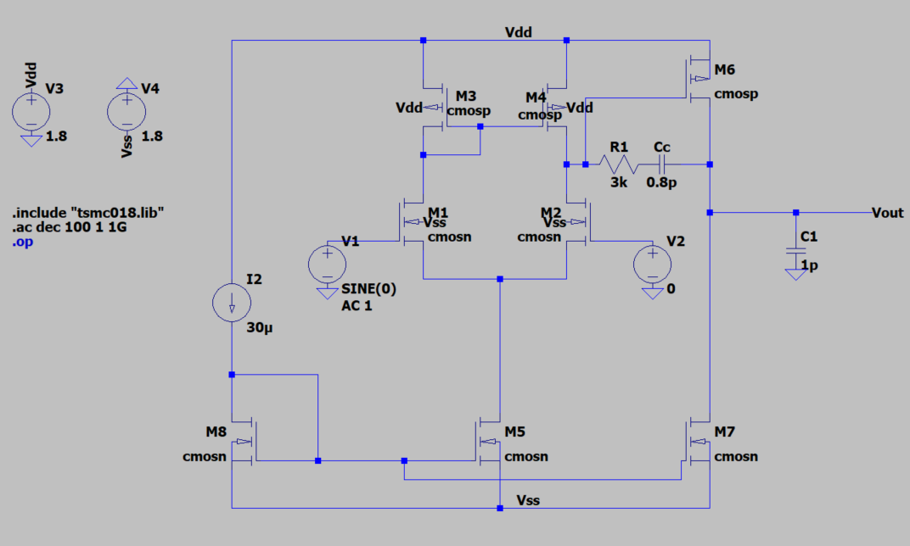
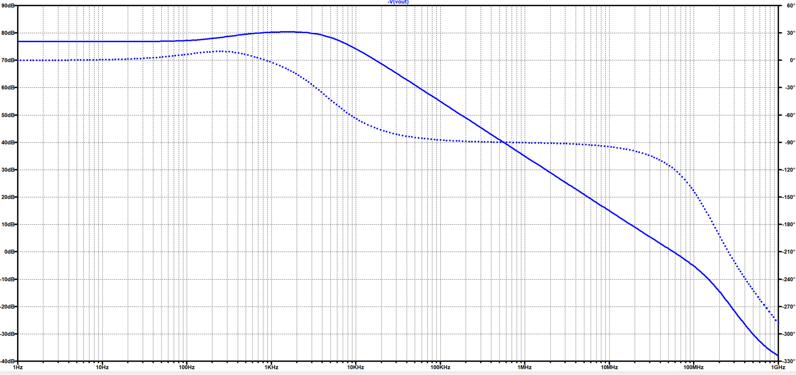
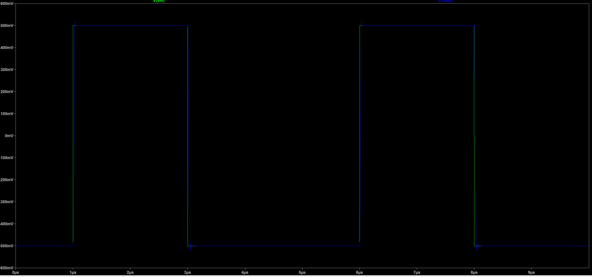
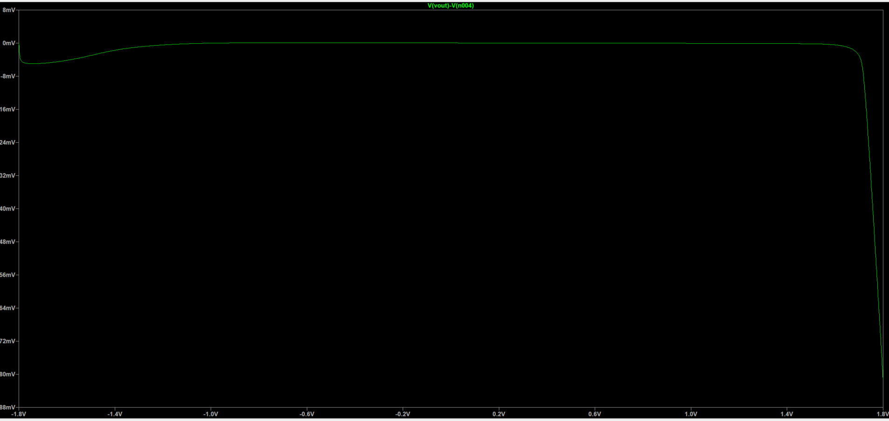

<h1 align="center">Two-Stage CMOS OTA with Miller Compensation</h1>

   

## Project Overview

I completed this project to gain additional experience in analog IC design outside school. 
My goal was to design a two-stage CMOS operational transconductance amplifier using 
LTspice with the TSMC 0.18 μm CMOS model while 
also meeting a set of performance specifications.

I first used hand calculations with IC design equations to estimate 
transistor dimensions, bias currents, and the compensation network. 
The circuit was then implemented in LTspice and refined until all design targets were achieved. During this process, I 
gained a deeper understanding of differential amplifiers, pole-zero behavior, and the 
tradeoffs involved in analog circuit design.

The design methodology presented here was developed using concepts 
from *CMOS Analog Circuit Design* by Allen and Holberg along with 
several IEEE publications on two-stage CMOS operational amplifiers. 
 

## Final Results

| Parameter | Target | Measured |
|-----------|:------:|:--------:|
| Supply Voltage | ±1.8 V | ±1.8 V |
| Load Capacitance | 1 pF | 1 pF |
| DC Gain | ≥ 60 dB | **78 dB** |
| Unity-Gain Bandwidth | ≥ 50 MHz | **55 MHz** |
| Phase Margin | ≥ 60° | **61.2°** |
| Slew Rate | ≥ 20 V/µs | **36.26 V/µs** |
| Power Dissipation | ≤ 2 mW | **0.67 mW** |
| Input Common-Mode Range | -1 V to 1.6 V | **−1.8 V to +1.7 V** |

## Design Methodology
LTspice simulations were performed using the TSMC 0.18 µm BSIM3 model library (tsmc018.lib).

The process parameters used for the initial hand calculations were:

| Parameter | Value |
|-----------|------:|
| UnCox | 230 µA/V² |
| UpCox | 97 µA/V² |
| VTN | 0.366 V |
| VTP | -0.391 V |

  

### 1. Design Specifications

| Specification | Target |
|:--------------|-------:|
| Supply Voltage | 1.8 V |
| CMOS Technology | 0.18 μm |
| DC Gain | ≥ 60 dB |
| Gain-Bandwidth Product | ≥ 50 MHz |
| Phase Margin | ≥ 60° |
| Slew Rate | ≥ 20 V/μs |
| Input Common-Mode Range | −1.0 V to 1.6 V |
| Load Capacitance | 1 pF |
| Power Dissipation | ≤ 2 mW |

These specifications were established before beginning the hand analysis and served as benchmarks throughout the design process.

### 2. Compensation Network

  

The initial Miller compensation capacitor was selected from the target unity-gain bandwidth and phase-margin requirements. A starting value of 1 pF was used for the hand design. The bias current was estimated from the target slew rate using the relationship between the available current and the compensation capacitor.

### 3. Differential Input Stage (M1–M2)

  

The required input-stage transconductance was calculated from the target unity-gain bandwidth and the initial Miller compensation capacitor. The resulting transconductance and branch current were then used to calculate an aspect ratio for M1.
M1 and M2 were assigned identical dimensions to maintain symmetry in the differential input pair.

### 4. Current Mirror Load and Tail Current Source (M3–M5)

  

The aspect ratio of M3 was calculated from the upper input common-mode requirement. M3 and M4 were assigned equal dimensions to form a 1:1 PMOS current mirror load. M5 was sized to provide the required tail current for the differential input stage.

### 5. Second Gain Stage (M6–M7)

  

The dimensions of M6 were calculated from the required second-stage transconductance and current, and M7 was sized to establish the corresponding bias condition.

### 6. Bias Network (M8)

M8 is a diode-connected NMOS transistor used to generate the gate-bias voltage for the NMOS current sources. Its dimensions were matched to M5 so that the reference branch established the initial 20 µA bias current.

## Design Optimization

The initial hand calculations provided a functional starting point for the OTA. The design was then refined through several simulation iterations until the target specifications were achieved.

**Initial LTspice implementation**

  

 - Although functional, the initial simulations showed that the amplifier did not fully satisfy the desired gain, bandwidth, and stability requirements. 

**Transistor optimization**
- Adjusted the W/L ratio for several transistors to increase open-loop gain.
- Changed L to 1 µm for each transistor.
- Increased the reference current from 20 µA to 30 µA to improve bandwidth.
  
| Device | Initial W/L *(L = 0.5 µm)* |            Final W/L *(L = 1 µm)* |                                                           
| ------ | -------------------------: | --------------------------------: | 
| M1–M2  |                      21.36 |                             21.40 | 
| M3–M4  |                       6.66 |                              6.66 |
| M5     |                       1.28 |                              1.28 |
| M6     |                      40.40 |                             40.40 |
| M7     |                       3.85 |                              5.00 | 
| M8     |                       1.28 |                              1.28 |

**Compensation optimization**
- Tuned the Miller compensation capacitor from 1 pF to 0.8 pF.
- Added a 3 kΩ series nulling resistor to improve phase margin while maintaining bandwidth.

---

## Final Design

  

The final OTA uses an NMOS differential input pair with a PMOS current-mirror load for the first gain stage, followed by a common-source second stage. A 0.8 pF Miller capacitor and 3 kΩ series nulling resistor provide frequency compensation. The final circuit is biased using a 30 µA reference current and drives a 1 pF load. 

## Simulation Results

### Open-Loop AC Response

  

The optimized OTA achieved a DC gain of approximately **78 dB**, a unity-gain bandwidth of **56 MHz**, and a phase margin of **61.2°**.

### Slew Rate

  

The measured positive and negative slew rates were approximately **36.26 V/µs** and **36.18 V/µs**, respectively.

### Input Common-Mode Range

  

Unity-gain operation was maintained across an input common-mode range of approximately **−1.8 V to +1.7 V**.

### Power Consumption

The simulated quiescent power consumption was approximately **0.67 mW** under the nominal bias conditions.

### Common-Mode Rejection Ratio (CMRR)

   

The OTA achieved a differential gain of 78 dB and a low-frequency common-mode gain of approximately −7 dB, yielding a CMRR of approximately **85 dB**.

## References
[1] P. E. Allen and D. R. Holberg, *CMOS Analog Circuit Design*, 2nd ed. Oxford University Press, 2002.

[2] M. Abdullah-Al-Kaiser and I. Jarin, "High Gain Low Offset Faster Two Stage CMOS Op-Amp and Effects of Aspect Ratios on Gain," *2017 IEEE International WIE Conference on Electrical and Computer Engineering (WIECON-ECE)*, Dehradun, India, 2017, pp. 253–256, doi:10.1109/WIECON-ECE.2017.8468913.

[3] C. L. Kavyashree, M. Hemambika, K. Dharani, A. V. Naik, and M. P. Sunil, "Design and Implementation of Two Stage CMOS Operational Amplifier Using 90 nm Technology," *2017 International Conference on Inventive Systems and Control (ICISC)*, Coimbatore, India, 2017, pp. 1–4, doi:10.1109/ICISC.2017.8068601.

[4] Y. Hao, M. Gandara, S. Mitra, S. Cochran, and B. Liu, "Design of a Two-Stage Miller-Compensated Operational Amplifier Using an EDA Tool-Centered Approach," *2024 20th International Conference on Synthesis, Modeling, Analysis and Simulation Methods and Applications to Circuit Design (SMACD)*, Volos, Greece, 2024, pp. 1–4, doi:10.1109/SMACD61181.2024.10745468.

[5] S. Vidhyadharan, *Installation of TSMC 180 nm Technology Files in LT SPICE & NMOS & PMOS Characterization*. Available: https://sanjayvidhyadharan.in/Downloads
