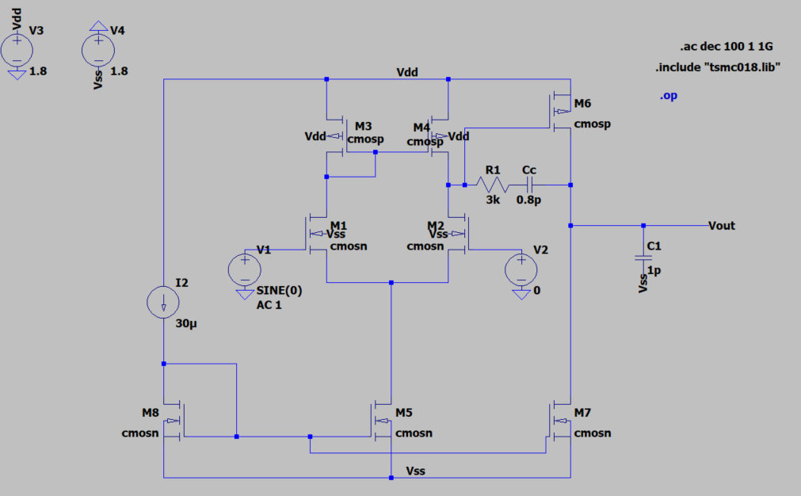

<h1 align="center">Two-Stage CMOS OTA with Miller Compensation</h1>

  

## Project Overview

This project was completed as part of my effort to learn analog IC design outside the classroom. The goal was to design a two-stage CMOS operational transconductance amplifier (OTA) from the transistor level using LTspice and the TSMC 0.18 μm CMOS process while meeting a set of performance specifications for gain, bandwidth, phase margin, slew rate, input common-mode range, and power consumption.

Rather than relying entirely on simulation, I first used hand calculations and analog IC design equations to estimate transistor dimensions, bias currents, and the compensation network. The circuit was then implemented in LTspice and refined through iterative simulation until all design targets were achieved. During this process, I gained a much deeper understanding of differential amplifiers, current mirrors, frequency compensation, pole-zero behavior, and the tradeoffs involved in analog circuit design.

The design methodology presented here was developed using concepts from *CMOS Analog Circuit Design* by Allen and Holberg along with several IEEE publications on two-stage CMOS operational amplifiers. These references served as learning resources throughout the project, while the circuit implementation, simulation, optimization, and verification were completed independently.

## Design Specifications

The objective of this project was to design a two-stage CMOS operational transconductance amplifier (OTA) that met a set of performance targets representative of a general-purpose analog amplifier. These specifications were established before beginning the transistor-level design and served as the benchmarks throughout the design, optimization, and verification process.

| Specification | Target |
|:--------------|-------:|
| Supply Voltage | 1.8 V |
| CMOS Process | TSMC 0.18 μm |
| DC Gain | ≥ 60 dB |
| Gain-Bandwidth Product | ≥ 50 MHz |
| Phase Margin | ≥ 60° |
| Slew Rate | ≥ 20 V/μs |
| Input Common-Mode Range | −1.0 V to 1.6 V |
| Load Capacitance | 1 pF |
| Power Dissipation | ≤ 2 mW |

## Final Results

## Circuit Architecture

## Design Methodology

The design was completed using the following workflow:

1. Defined the design specifications for gain, bandwidth, phase margin, slew rate, power consumption, and input common-mode range.
2. Performed hand calculations to determine the initial transistor aspect ratios, bias currents, and Miller compensation network.
3. Implemented the complete schematic in LTspice using the TSMC 0.18 μm BSIM3 CMOS model library.
4. Verified the DC operating point to ensure every transistor operated in saturation.
5. Optimized transistor dimensions and bias currents to improve gain, bandwidth, and power consumption.
6. Tuned the Miller compensation capacitor and series nulling resistor to achieve the desired BW and phase margin.
7. Verified the completed design using AC, transient, DC sweep, and operating-point simulations.

The complete hand calculations used to obtain the initial device dimensions are included in **docs/Hand_Calculations.pdf**.

## Design Methodology

The OTA was designed from the transistor level using first-order hand calculations followed by iterative optimization in LTspice. Each stage of the design built upon the previous one until all performance specifications were met.

### 1. Initial Design Specifications

Short paragraph.

### 2. Differential Input Pair (M1–M2)

Explain:
- chose overdrive
- calculated gm
- calculated W/L
- role of differential pair

Insert hand calculation screenshot.

---

### 3. Current Mirror Active Load (M3–M4)

Explain:
- converts differential to single-ended
- sizing
- current mirror ratio

Insert calculations.

---

### 4. Tail Current Source (M5)

Explain:
- bias current selection
- effect on gm and slew rate

---

### 5. Second Gain Stage (M6–M7)

Explain:
- common-source stage
- additional voltage gain
- output swing considerations

---

### 6. Miller Compensation

This deserves its own section.

Explain:
- chose Cc
- dominant pole
- initial poor phase margin
- added series nulling resistor
- tuned Rz

Show Bode plots before/after if you have them.

---

### 7. Final Design

Show final schematic.

One paragraph explaining the completed OTA.
## Simulation Results
    AC Response
    Slew Rate
    ICMR
    Operating Point

## Design Tradeoffs

## Files

## References

[1] P. E. Allen and D. R. Holberg, *CMOS Analog Circuit Design*, 2nd ed. Oxford University Press, 2002.

[2] M. Abdullah-Al-Kaiser and I. Jarin, "High Gain Low Offset Faster Two Stage CMOS Op-Amp and Effects of Aspect Ratios on Gain," *2017 IEEE International WIE Conference on Electrical and Computer Engineering (WIECON-ECE)*, Dehradun, India, 2017, pp. 253–256, doi:10.1109/WIECON-ECE.2017.8468913.

[3] C. L. Kavyashree, M. Hemambika, K. Dharani, A. V. Naik, and M. P. Sunil, "Design and Implementation of Two Stage CMOS Operational Amplifier Using 90 nm Technology," *2017 International Conference on Inventive Systems and Control (ICISC)*, Coimbatore, India, 2017, pp. 1–4, doi:10.1109/ICISC.2017.8068601.

[4] Y. Hao, M. Gandara, S. Mitra, S. Cochran, and B. Liu, "Design of a Two-Stage Miller-Compensated Operational Amplifier Using an EDA Tool-Centered Approach," *2024 20th International Conference on Synthesis, Modeling, Analysis and Simulation Methods and Applications to Circuit Design (SMACD)*, Volos, Greece, 2024, pp. 1–4, doi:10.1109/SMACD61181.2024.10745468.
